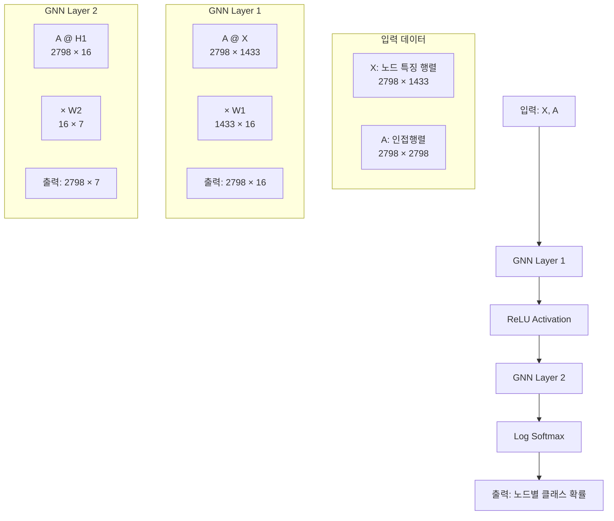
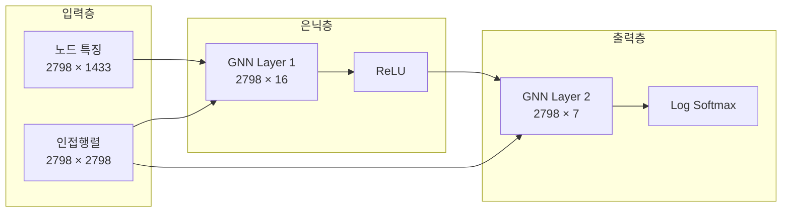
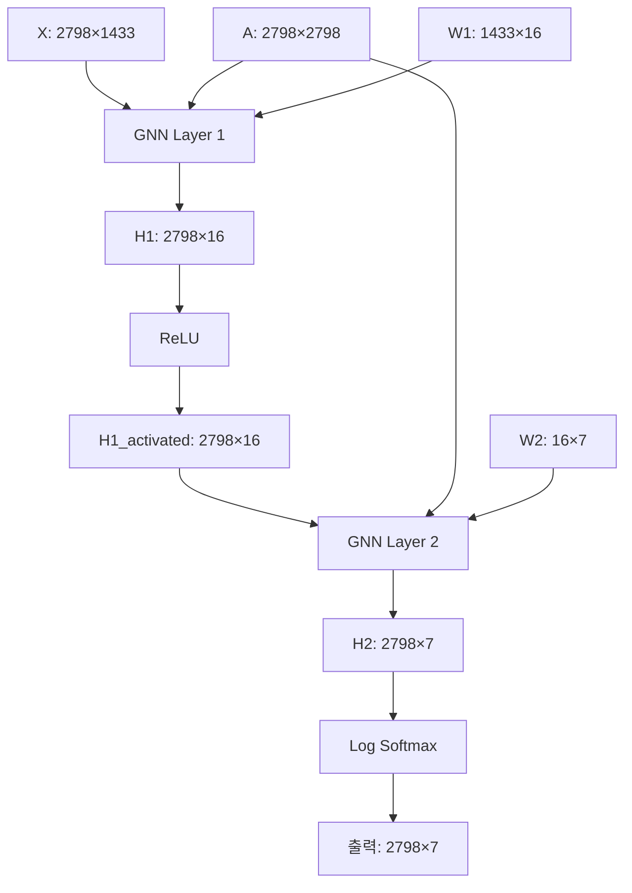
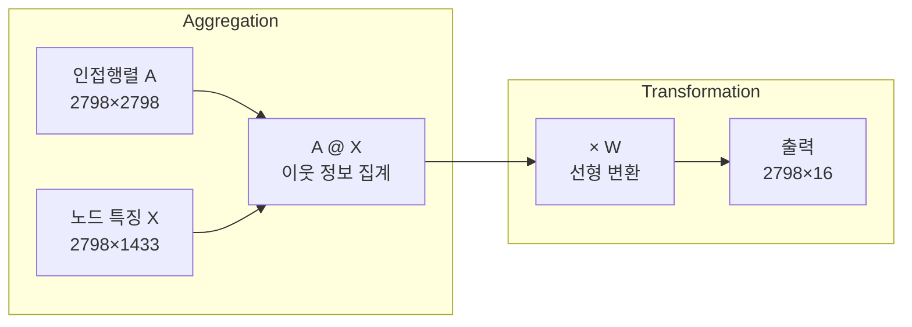
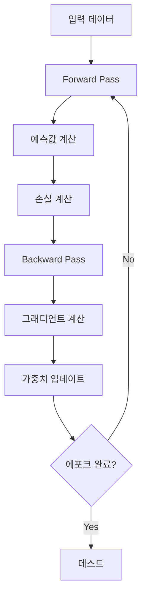
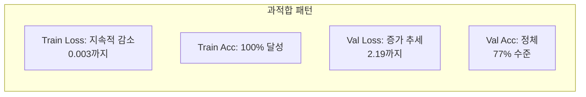
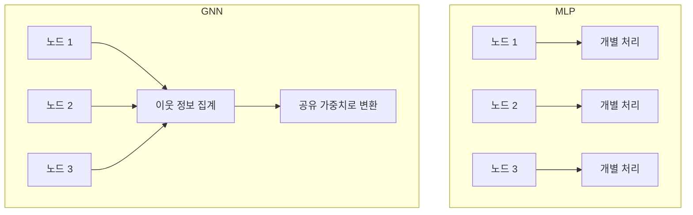

# VanillaGNN 구조 분석

## 📋 목차
1. [모델 개요](#-1-모델-개요)
2. [입력 데이터 구조](#-2-입력-데이터-구조)
3. [네트워크 아키텍처](#-3-네트워크-아키텍처)
4. [Forward 연산 과정](#-4-forward-연산-과정)
5. [VanillaGNNLayer 상세 분석](#-5-vanillagnnlayer-상세-분석)
6. [학습 과정](#-6-학습-과정)
7. [실험 결과 및 분석](#-7-실험-결과-및-분석)
8. [MLP vs GNN 비교](#-8-mlp-vs-gnn-비교)
9. [옵티마이저 정리](#-9-옵티마이저-정리)

---

## ✅ 1. 모델 개요

```python
class VanillaGNN(torch.nn.Module):
```

이 클래스는 PyTorch의 기본 신경망 모듈인 `torch.nn.Module`을 상속한 **2-layer GNN**입니다. 

### 🎯 핵심 아이디어
**VanillaGNN은 기본적으로 Dense Layer에 Adjacency Layer를 추가한 구조**입니다.

```python
VanillaGNN (
  (gnn1): VanillaGNNLayer(
    (linear): Linear(in_features=1433, out_features=16, bias=False)
  )
  (gnn2): VanillaGNNLayer(
    (linear): Linear(in_features=16, out_features=7, bias=False)
  )
)
```

### 🏗️ 전체 구조 다이어그램



---

## ✅ 2. 입력 데이터 구조

### 📊 데이터 차원 정보
- **노드 수**: 2,798개
- **입력 특징 차원**: 1,433개
- **출력 클래스 수**: 7개

### 🔢 행렬 차원 정리

| 구성 요소 | 차원 | 설명 |
|---------|------|------|
| **X (노드 특징)** | 2798 × 1433 | 각 노드의 1433개 특징 |
| **A (인접행렬)** | 2798 × 2798 | 그래프 연결 정보 |
| **W1 (가중치1)** | 1433 × 16 | 입력 → 은닉층 |
| **W2 (가중치2)** | 16 × 7 | 은닉층 → 출력층 |

### 🎯 핵심 수식: `A^T × W`
- **A^T**: 인접행렬의 전치 (2798 × 2798)
- **W**: 가중치 행렬 (1433 × 16)
- **연산**: `A^T @ X @ W` 형태로 수행

---

## ✅ 3. 네트워크 아키텍처

```python
self.gnn1 = VanillaGNNLayer(dim_in, dim_h)    # 1433 → 16
self.gnn2 = VanillaGNNLayer(dim_h, dim_out)   # 16 → 7
```

### 🏛️ 레이어 구성 다이어그램



---

## ✅ 4. Forward 연산 과정

```python
def forward(self, x, adjacency):
    h = self.gnn1(x, adjacency)     # 1단계: 인접행렬과 특징을 곱함
    h = torch.relu(h)               # 비선형 활성화
    h = self.gnn2(h, adjacency)     # 2단계: 다시 메시지 전달
    return F.log_softmax(h, dim=1)  # 최종 출력: 노드 분류를 위한 log_softmax
```

### 🔄 연산 흐름 상세



### 📐 수식 표현

**Layer 1**: `H₁ = ReLU(A × X × W₁ + b₁)`
- `A × X`: 2798×2798 × 2798×1433 = 2798×1433
- `× W₁`: 2798×1433 × 1433×16 = 2798×16

**Layer 2**: `H₂ = A × H₁ × W₂ + b₂`
- `A × H₁`: 2798×2798 × 2798×16 = 2798×16
- `× W₂`: 2798×16 × 16×7 = 2798×7

**최종 출력**: `Z = log_softmax(H₂)`

---

## ✅ 5. VanillaGNNLayer 상세 분석

### 🧩 Layer 구조

```python
class VanillaGNNLayer(torch.nn.Module):
    def __init__(self, dim_in, dim_out):
        super().__init__()
        self.linear = torch.nn.Linear(dim_in, dim_out, bias=False)  # bias=False 주목!

    def forward(self, x, adjacency):
        out = torch.matmul(adjacency, x)        # A @ X
        out = self.linear(out)                  # (A @ X) @ W
        return out
```

### 🔍 메시지 전달 과정



### 💡 핵심 아이디어

> **이웃 노드의 정보를 모아서(aggregate) W로 투사한다.**

- **Aggregation**: `A @ X` - 각 노드가 이웃 노드들의 특징을 평균/합산
- **Transformation**: `@ W` - 집계된 정보를 새로운 특징 공간으로 투사

---

## ✅ 6. 학습 과정

### 🎯 손실 함수와 옵티마이저

```python
def fit(self, data, epochs):
    criterion = torch.nn.CrossEntropyLoss()
    optimizer = torch.optim.Adam(self.parameters(), lr=0.01, weight_decay=5e-4)
```

### 🔄 학습 루프

```python
for epoch in range(epochs+1):
    self.train()
    optimizer.zero_grad()
    out = self(data.x, adjacency)  # forward pass
    loss = criterion(out[data.train_mask], data.y[data.train_mask])
    loss.backward()                # backward pass
    optimizer.step()               # 가중치 업데이트
```

### 📊 학습 과정 다이어그램



### 🧪 테스트 함수

```python
def test(self, data):
    self.eval()
    out = self(data.x, adjacency)
    acc = accuracy(out[data.test_mask], data.y[data.test_mask])
    return acc
```

---

## ✅ 7. 실험 결과 및 분석

### 📈 학습 결과

| Epoch | Train Loss | Train Acc | Val Loss | Val Acc |
|-------|------------|-----------|----------|---------|
| 0     | 1.991      | 15.71%    | 2.11     | 9.40%   |
| 20    | 0.065      | 99.29%    | 1.47     | 76.80%  |
| 40    | 0.014      | 100.00%   | 2.11     | 75.40%  |
| 60    | 0.007      | 100.00%   | 2.22     | 75.40%  |
| 80    | 0.004      | 100.00%   | 2.20     | 76.80%  |
| 100   | 0.003      | 100.00%   | 2.19     | 77.00%  |

**최종 테스트 정확도: 76.60%**

### 🚨 과적합(Overfitting) 분석



#### 🔍 과적합 증상
1. **Train Loss**: 1.991 → 0.003 (지속적 감소)
2. **Train Accuracy**: 15.71% → 100% (완벽한 학습)
3. **Validation Loss**: 2.11 → 2.19 (증가 추세)
4. **Validation Accuracy**: 9.40% → 77% (정체)

#### 💡 과적합 원인
- **모델 복잡도**: 2-layer GNN이 데이터에 비해 복잡
- **데이터 부족**: 학습 데이터가 충분하지 않음
- **정규화 부족**: Dropout이나 더 강한 weight decay 필요

#### 🛠️ 개선 방안
1. **Early Stopping**: Validation Loss 증가 시점에서 학습 중단
2. **Dropout 추가**: 과적합 방지
3. **Weight Decay 증가**: 5e-4 → 1e-3
4. **모델 단순화**: 은닉층 차원 축소

---

## ✅ 8. MLP vs GNN 비교

| 항목      | MLP                  | GNN                        |
| ------- | -------------------- | -------------------------- |
| 연결성     | 노드 간 정보 공유 없음        | 이웃 노드와 정보 공유 (메시지 전달)      |
| 입력 구조   | Dense feature matrix | Feature + adjacency matrix |
| 연산      | `x @ W`              | `A @ x @ W`                |
| 파라미터 공유 | 없음                   | 있음 (W는 여러 노드에 공유됨)         |

### 🔍 핵심 차이점 다이어그램



---

## ✅ 9. 옵티마이저 정리

### 🎯 주요 옵티마이저 비교

| 옵티마이저     | 특징                             |
| --------- | ------------------------------ |
| GD        | 모든 데이터를 사용, 계산량 많음             |
| SGD       | 샘플 단위로 빠르게 업데이트                |
| Momentum  | 진동 감소, 지역 최소 탈출 도움             |
| NAG       | 미래 예측으로 더 정교한 업데이트             |
| Adagrad   | 파라미터별 적응적 학습률, 그러나 감소 과다       |
| RMSprop   | 최근 업데이트 중심, 안정적 학습 유지          |
| **Adam**  | **Momentum + RMSprop + 보정, 널리 사용** |
| Adabelief | Adam 변형 (간단 언급만)               |

### 🏆 VanillaGNN에서 사용하는 Adam

```python
optimizer = torch.optim.Adam(self.parameters(), lr=0.01, weight_decay=5e-4)
```

- **학습률**: 0.01
- **Weight Decay**: 5e-4 (L2 정규화)
- **장점**: 자동으로 학습률 조정, 빠른 수렴, 과적합 방지

---

## 📚 참고 자료

- [Optimizer 종류 및 정리](https://velog.io/@chang0517/Optimizer-%EC%A2%85%EB%A5%98-%EB%B0%8F-%EC%A0%95%EB%A6%AC)

