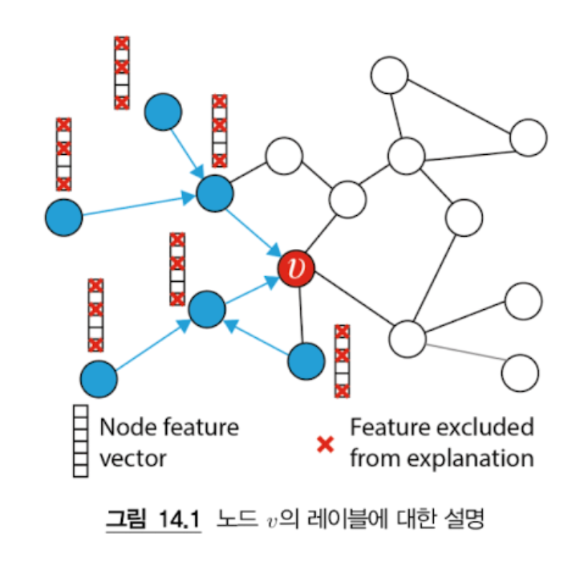
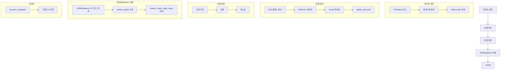
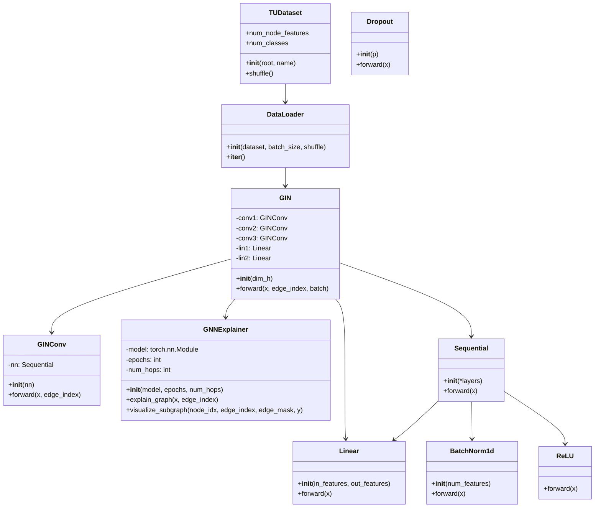
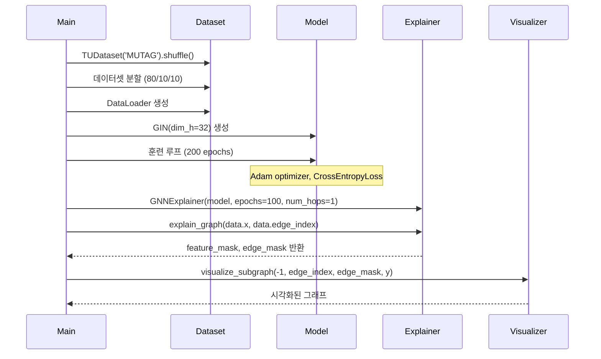
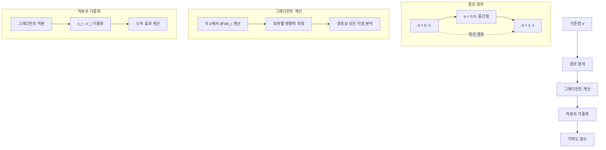
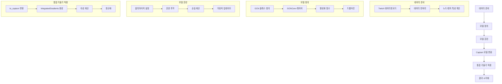
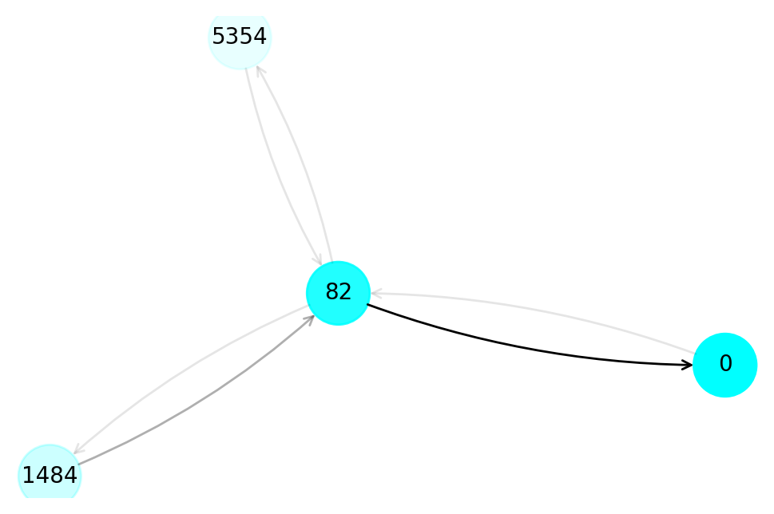
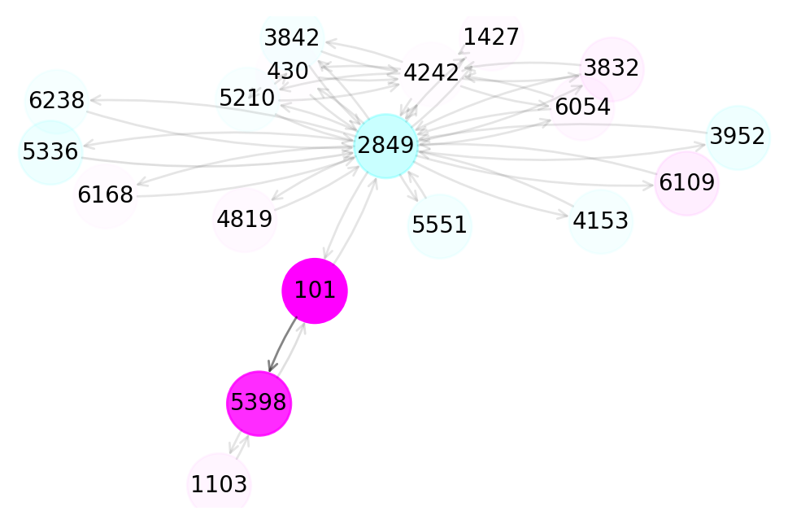
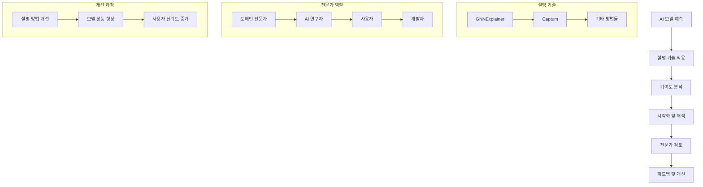
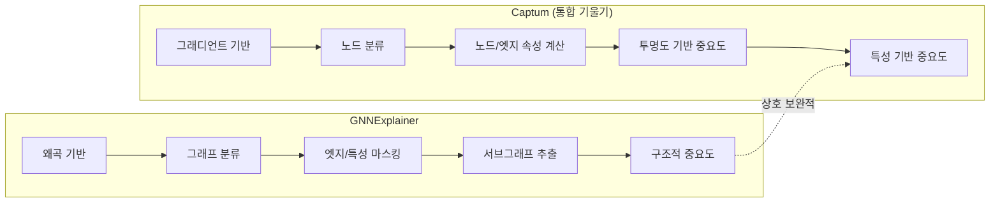

# Chapter 14 그래프 인공신경망 설명하기 

> **핵심 질문**: GNN의 예측 결과를 어떻게 이해하고 설명할 수 있을까?


### 📚 다룰 내용
1. **[설명 기술 소개하기](#-설명-기술의-분류)**
2. **[GNNExplainer를 활용한 GNN 설명하기](#-gnnexplainer를-활용한-gnn-설명하기)**
   - [MUTAG 데이터셋](#데이터셋-mutag)을 사용한 그래프 분류 문제
3. **[Captum을 활용한 GNN 설명하기](#-captum을-활용한-gnn-설명하기)**
   - [Twitch 소셜 네트워크 데이터셋](#데이터셋-twitch-소셜-네트워크)을 사용한 노드 분류 문제

---

## 🔍 설명 기술의 분류

### 1. 모델 유형별 분류

| 모델 유형 | 특징 | 예시 |
|-----------|------|------|
| **해석 가능한 모델** | 인간이 직관적으로 이해할 수 있는 모델 | 의사결정 트리 |
| **설명 가능한 모델** | 블랙박스 모델로, 설명 기술을 적용해야 이해 가능 | 신경망 |

### 2. 지역적 해석 기술의 4가지 카테고리

> **💡 지역적 해석**: 개별 예측에 기반 (이번 장의 초점)

| 카테고리 | 설명 | 특징 |
|----------|------|------|
| **기울기(gradient) 기반 방법** | 속성 점수의 기울기를 측정 | 연속적 특성에 효과적 |
| **왜곡(perturbation) 기반 방법** | 입력 특성을 마스킹하거나 변경하여 출력 변화를 측정 | 이산적 특성에 효과적 |
| **분해(decomposition) 방법** | 모델의 예측을 여러 부분으로 나누어 중요도 측정 | 복잡한 모델에 적합 |
| **대리자(surrogate) 방법** | 간단하고 해석 가능한 모델을 사용하여 기존 모델의 예측을 근사 | 직관적 이해 용이 |

> **🔗 특징**: 각 기술은 엣지와 특성 값의 기여도를 다르게 측정하므로 상호 보완적이며, 예측 설명을 개선하기 위해 여러 기술을 조합하여 사용 가능

---

## 😭 설명 품질 지표

### 1. 신뢰도 (Fidelity)

> **정의** 원본 그래프 `G_i`와 수정된 그래프 `Ĝ_i` 간의 예측 확률 비교 지표

**목적**: 수정된 그래프 `Ĝ_i`는 `y_i`의 설명에 따라 가장 중요한 특성(노드, 엣지, 노드 특성 값)만 유지

---

> **Q. 수정된 그래프라는 것이 이해가 안된다. 어떤 수정이 가능한지?**

수정된 그래프는 원본 그래프에서 설명에 불필요한 요소들을 제거하거나 변경한 그래프를 의미합니다. 구체적으로는 노드를 삭제하거나, 엣지를 제거하거나, 노드의 특성값을 마스킹하는 등의 작업이 가능합니다. 예를 들어, 화학 분자 그래프에서 특정 원자(노드)나 화학 결합(엣지)을 제거하여 분류에 실제로 중요한 부분만 남겨두는 것입니다. 이렇게 수정된 그래프에서의 예측 결과와 원본 그래프의 예측 결과를 비교하여 설명의 품질을 평가합니다.
> **Q. 샘플이라 함은 항상 노드를 뜻하는가?**

아니요, 샘플은 항상 노드를 뜻하지는 않습니다. 샘플의 의미는 문제의 맥락에 따라 달라집니다. 그래프 분류 문제에서는 각 그래프가 하나의 샘플이 되고, 노드 분류 문제에서는 각 노드가 하나의 샘플이 됩니다. 예를 들어, MUTAG 데이터셋에서는 188개의 화학 분자 그래프가 각각 하나의 샘플이며, 각 그래프는 여러 개의 노드(원자)로 구성되어 있습니다. 따라서 신뢰도 공식에서 N은 총 그래프의 수를 의미하며, 각 그래프에 대해 원본과 수정된 버전의 예측 확률 차이를 계산하는 것입니다.

**공식**
```
Fidelity = (1/N) * Σ_{i=1 to N} (f(G_i)_yi - f(Ĝ_i)_yi)
```

| 변수 | 설명 |
|------|------|
| N | 총 샘플 수 |
| f | 예측 함수 |
| G_i | 원본 그래프 |
| Ĝ_i | 수정된 그래프 |
| y_i | 실제 레이블 |

### 2. 희소도 (Sparsity)

> **정의**: 중요한 것으로 간주되는 특성의 부분집합을 측정

**목적**: 너무 길거나 복잡한 설명은 혼란을 야기하므로 간결한 설명을 목표

**공식**:
```
Sparsity = (1/N) * Σ_{i=1 to N} (1 - |m_i| / |M_i|)
```

| 변수 | 설명 |
|------|------|
| \|m_i\| | 중요한 입력 특성의 수 |
| \|M_i\| | 총 특성 수 |

---

## 🗂️ 평가 데이터셋

> **일반적인 그래프 외에도 다음 생성된 데이터셋에서 자주 평가됨**

| 데이터셋 | 특징 | 용도 |
|----------|------|------|
| **BA-Shapes** | Barabási-Albert 모델 기반 | 기본 구조 패턴 평가 |
| **BA-Community** | 커뮤니티 구조 포함 | 커뮤니티 감지 평가 |
| **Tree-Cycles** | 트리 구조에 사이클 추가 | 순환 패턴 인식 평가 |
| **Tree-Grid** | 트리 구조에 격자 추가 | 복합 구조 이해 평가 |

> **💡 장점**: 이 데이터셋들은 그래프 생성 알고리즘을 사용하여 특정 패턴을 생성하며, 구현과 이해가 쉬워 흥미로운 대안이 됨

---

## 🔬 GNNExplainer를 활용한 GNN 설명하기



### GNNExplainer 소개

> **출처**: [Ying et al. (2019)](https://arxiv.org/abs/1903.03894)에 의해 제안

| 항목 | 내용 |
|------|------|
| **목적** | 다양한 GNN 모델의 예측 값을 설명하기 위한 GNN 구조 |
| **배경** | 구조화된(표 형태) 데이터에서는 어떤 특성이 예측에 가장 중요한지 식별하는 것이 목표 |
| **특징** | 그래프 데이터에서는 어떤 노드가 가장 영향력 있는지도 중요 |
| **필요성** | 전통적인 방법만으로는 부족하여 GNNExplainer가 필요 |

### GNNExplainer 작동 원리

> **핵심 아이디어**: 서브그래프 `G_s`를 활용하여 예측을 설명

- **노드 중심 설명**: 특정 노드 v의 레이블에 대한 설명을 제공
- **특성 마스킹**: 중요하지 않은 특성은 설명에서 제외하여 명확성 향상
- **왜곡 기반 방법**: 입력을 변경하여 출력 변화를 측정하는 방식
---
> **Q. GNNExplainer의 구체적인 작동 순서는 어떻게 되는가?**

GNNExplainer는 다섯 단계로 구성된 과정을 통해 그래프 신경망의 예측을 설명합니다. 

[1] 엣지 마스크 생성입니다. 이 단계에서는 그래프의 모든 연결선(엣지)에 0과 1 사이의 가중치를 부여합니다. 가중치가 1에 가까울수록 해당 연결이 예측에 중요한 역할을 한다는 의미입니다. 예를 들어, 화학 분자에서 특정 원자들 사이의 결합이 분류에 결정적이라면 그 엣지의 마스크 값은 높게 설정됩니다.

[2] 피처 마스크 생성입니다. 각 노드(원자)는 여러 특성을 가지고 있는데, 이 중에서 예측에 실제로 기여하는 특성들만 선택합니다. 마스크는 각 특성에 대해 0 또는 1의 값을 가지며, 1은 해당 특성이 중요하다는 것을 의미합니다.

[3] 결과 재현 검증입니다. 생성된 마스크를 적용한 그래프에서 원본 모델과 동일한 예측 결과가 나오는지 확인합니다. 만약 결과가 다르다면 마스크가 너무 많은 정보를 제거했다는 의미이므로 마스크를 조정해야 합니다.

[4] mutual information 최적화입니다. 이는 정보 이론에서 나온 개념으로, 원본 그래프의 예측과 마스킹된 그래프의 예측이 얼마나 유사한 정보를 담고 있는지를 측정합니다. 이 값을 최대화하면서도 마스크가 너무 복잡하지 않도록 균형을 맞춥니다.

[5] 정규화입니다. 마스크 값들이 너무 극단적이 되지 않도록 0과 1 사이의 범위로 조정하고, 전체 마스크의 합이 적절한 수준을 유지하도록 합니다. 이를 통해 안정적이고 해석 가능한 설명을 생성할 수 있습니다.

---

## 🧪 GNNExplainer 구현하기

### 데이터셋: [MUTAG](https://pytorch-geometric.readthedocs.io/en/latest/generated/torch_geometric.datasets.TUDataset.html)

| 속성 | 설명 |
|------|------|
| **구성** | 188개의 그래프로 구성 |
| **구조** | 각 그래프는 원자(노드)와 화학 결합(간선)으로 이루어진 화합물 |
| **특성값** | 노드와 간선 특성값은 원자와 간선 타입의 원핫 인코딩으로 표현 |
| **목표** | 화합물을 박테리아 *Salmonella typhimurium*에 주는 돌연변이 유발 효과에 따라 두 클래스로 분류 |

### 모델: GIN(Graph Isomorphism Network)

> **[9장에서 소개된 단백질 분류 모델](../WEEK05/chapter9.ipynb) 재사용**

- GNNExplainer를 활용하여 분류에 가장 중요한 서브그래프 및 노드 특성 식별
- 간선 특성값은 무시

---

## 💻 구현 단계

### 1. 필요한 클래스 임포트

```python
import matplotlib.pyplot as plt
import torch.nn.functional as F
from torch.nn import Linear, Sequential, BatchNorm1d, ReLU, Dropout
from torch_geometric.datasets import TUDataset
from torch_geometric.loader import DataLoader
from torch_geometric.nn import GINConv, global_add_pool, GNNExplainer
```

### 2. MUTAG 데이터셋 로드 및 셔플

```python
dataset = TUDataset(root='.', name='MUTAG').shuffle()
```

### 3. 훈련, 검증, 테스트 셋 생성

```python
train_dataset = dataset[:int(len(dataset)*0.8)]
val_dataset = dataset[int(len(dataset)*0.8):int(len(dataset)*0.9)]
test_dataset = dataset[int(len(dataset)*0.9):]
```

---

## 🏗️ GNNExplainer 구현 구조 다이어그램



---

## 🏛️ 클래스 및 함수 상세 구조



---

## 🔄 주요 함수 플로우



---

## ⚙️ 핵심 컴포넌트 설명

### 1. GIN 모델 구조

| 구성 요소 | 역할 |
|-----------|------|
| **3개의 GINConv 레이어** | 그래프 구조 학습 |
| **Sequential 블록** | 각 GINConv 내부의 MLP |
| **global_add_pool** | 그래프 수준 표현 생성 |
| **Linear 레이어** | 최종 분류 |

### 2. GNNExplainer 작동 과정

| 단계 | 설명 |
|------|------|
| **모델 래핑** | 기존 GNN 모델을 감싸서 설명 가능하게 만듦 |
| **그래디언트 계산** | 중요도 점수 계산 |
| **마스크 생성** | 노드와 엣지의 중요도 마스크 생성 |
| **서브그래프 추출** | 중요한 부분만 선택 |

### 3. 데이터 플로우

> **🔄 전체 처리 과정**

| 단계 | 입력 | 처리 | 출력 |
|------|------|------|------|
| **입력** | 그래프 데이터 (노드 특성, 엣지 인덱스) | - | - |
| **처리** | - | GNN 모델을 통한 예측 | - |
| **설명** | - | GNNExplainer를 통한 중요도 분석 | - |
| **출력** | - | - | 시각화된 중요 서브그래프 |

---

## 🔍 Captum을 활용한 GNN 설명하기

### Captum과 통합 기울기 소개

> **[Captum (captum.ai)](https://captum.ai/)**: PyTorch 모델을 위한 다양한 최신 설명 알고리즘을 구현한 Python 라이브러리

| 특징 | 설명 |
|------|------|
| **범용성** | GNN뿐만 아니라 텍스트, 이미지, 표 형태 데이터 등 다양한 데이터 타입에 적용 가능 |
| **기술 비교** | 동일한 예측에 대해 다양한 설명 방법을 빠르게 테스트하고 비교 가능 |
| **구현된 알고리즘** | [LIME](https://github.com/marcotcr/lime), [Gradient SHAP](https://github.com/slundberg/shap) 등 잘 알려진 알고리즘들 포함 |

### 통합 기울기 (Integrated Gradients) 원리

> **목표**: 모든 입력 특성 값에 속성 점수 할당

**핵심 아이디어**: 
- 입력 `x`와 기준 입력 `x'` (모든 엣지의 가중치가 0) 사이의 경로를 따라 그래디언트를 계산하고 누적
- `x`와 `x'` 사이의 모든 지점에서 그래디언트를 계산

통합 기울기는 모델의 예측을 해석하기 위한 방법으로서, 신경망에서 입력 피처의 기여도를 정량화하는 데 사용됩니다. 이 방법은 모델의 출력을 연속적으로 변화시키는 입력의 경로를 따라 그래디언트를 적분함으로써, 해당 입력 피처가 모델 출력에 어떠한 영향을 미치는지 설명합니다.

#### 📐 수학적 정의

```
IntegratedGrads_i(x) ::= (x_i - x'_i) × ∫[α=0 to 1] (∂F(x' + α × (x - x')) / ∂x_i) dα
```

> **📖 참고 자료**: [통합 기울기 상세 설명](https://wikidocs.net/204777)

#### 🔍 수식 구성 요소 분석

| 변수 | 설명 | 역할과 의미 |
|------|------|-------------|
| `IntegratedGrads_i(x)` | 입력 x의 i번째 차원에 대한 통합 기울기 | **결과값**: i번째 입력 피처의 기여도 점수 |
| `x_i` | 입력 x의 i번째 구성 요소 | **현재 입력**: 분석하고자 하는 실제 입력값 |
| `x'_i` | 기준 입력 x'의 i번째 구성 요소 | **기준점**: 모든 피처가 중립적인 상태 (보통 0 또는 평균값) |
| `F` | 모델 함수 | **예측 모델**: 입력을 받아 출력을 생성하는 신경망 |
| `α` | 0에서 1까지 변화하는 스칼라 | **보간 매개변수**: 기준점에서 실제 입력까지의 경로를 정의 |


#### 🔄 작동 원리와 증감 관계



**1. 경로 정의**: 
- `α = 0`일 때: `x'` (기준점, 모든 피처가 중립)
- `α = 1`일 때: `x` (실제 입력값)
- `α`가 0→1로 증가: 기준점에서 실제 입력까지의 직선 경로

**2. 그래디언트 계산**:
- 각 `α` 값에서 `∂F(x' + α × (x - x')) / ∂x_i` 계산
- 이는 해당 지점에서 i번째 피처의 변화가 모델 출력에 미치는 영향

**3. 적분과 가중화**:
- 모든 경로상의 그래디언트를 적분하여 누적 효과 계산
- `(x_i - x'_i)`로 가중화하여 실제 입력 변화량을 반영

#### ✨ 핵심 장점: 합계 성질 (Summation Property)

통합 기울기의 가장 중요한 특징은 **합계 성질**을 가진다는 점입니다:

```
Σ_i IntegratedGrads_i(x) = F(x) - F(x')
```

**의미**:
- 모든 피처의 기여도 합계 = 모델 예측의 전체 변화량
- 이는 모델 해석이나 디버깅에 큰 도움을 줍니다
- 높은 해석력을 가지는 것으로 인정받았습니다

**실제 구현**: 적분은 직접 계산하지 않고 이산 합으로 근사

### 통합 기울기의 두 가지 원칙

1. **민감성(Sensitivity)**: 예측에 관여하는 모든 인풋은 0이 아닌 속성을 받아야만 한다.
2. **구현 불변(Implementation invariance)**: 모든 인풋에 대해 아웃풋이 동일한 두 인공신경망은 동일한 특성값을 가져야만 한다.

> **💡 그래프 버전**: 특성 대신 노드와 엣지를 고려하며, [GNNExplainer](#-gnnexplainer를-활용한-gnn-설명하기)와 상호 보완적

---

## 🧪 통합 기울기 구현하기

### 데이터셋: [Twitch 소셜 네트워크](https://pytorch-geometric.readthedocs.io/en/latest/generated/torch_geometric.datasets.Twitch.html)

| 속성 | 설명 |
|------|------|
| **구성** | Twitch 스트리머들을 노드로 하는 소셜 네트워크 |
| **연결** | 사용자 간의 친구 관계를 나타내는 엣지 |
| **노드 특성** | 1128차원 특성 (취미, 위치, 좋아하는 게임 등) |
| **목표** | 스트리머가 명시적 언어를 사용하는지 여부 분류 |

### 구현 과정



#### 1. Captum 라이브러리 설치
```python
!pip install captum
```

#### 2. 필요한 라이브러리 임포트
```python
import numpy as np
import matplotlib.pyplot as plt
import torch.nn.functional as F
from captum.attr import IntegratedGradients

import torch_geometric.transforms as T
from torch_geometric.datasets import Twitch
from torch_geometric.nn import Explainer, GCNConv, to_captum
```

#### 3. 데이터셋 로드 및 모델 정의
```python
dataset = Twitch('.', name="EN")
data = dataset[0]

class GCN(torch.nn.Module):
    def __init__(self, dim_h):
        super().__init__()
        self.conv1 = GCNConv(dataset.num_features, dim_h)
        self.conv2 = GCNConv(dim_h, dataset.num_classes)

    def forward(self, x, edge_index):
        h = self.conv1(x, edge_index).relu()
        h = F.dropout(h, p=0.5, training=self.training)
        h = self.conv2(x, edge_index)
        return F.log_softmax(h, dim=1)
```

#### 4. 모델 훈련
```python
device = torch.device('cuda' if torch.cuda.is_available() else 'cpu')
model = GCN(64).to(device)
data = data.to(device)
optimizer = torch.optim.Adam(model.parameters(), lr=0.001, weight_decay=5e-4)

for epoch in range(200):
    model.train()
    optimizer.zero_grad()
    log_logits = model(data.x, data.edge_index)
    loss = F.nll_loss(log_logits, data.y)
    loss.backward()
    optimizer.step()

# 정확도 확인
@torch.no_grad()
def test(model, data):
    model.eval()
    out = model(data.x, data.edge_index)
    acc = accuracy(out.argmax(dim=1), data.y)
    return acc

acc = test(model, data)
print(f'Accuracy: {acc*100:.2f}%')
```

#### 5. 통합 기울기 적용
```python
node_idx = 0  # 분석할 노드 인덱스
captum_model = to_captum(model, mask_type='node_and_edge', output_idx=node_idx)
ig = IntegratedGradients(captum_model)
edge_mask = torch.ones(data.num_edges, requires_grad=True, device=device)

# 속성 계산
attr_node, attr_edge = ig.attribute(
    (data.x.unsqueeze(0), edge_mask.unsqueeze(0)),
    target=int(data.y[node_idx]),
    additional_forward_args=(data.edge_index),
    internal_batch_size=1)

# 정규화
attr_node = attr_node.squeeze(0).abs().sum(dim=1)
attr_node /= attr_node.max()
attr_edge = attr_edge.squeeze(0).abs()
attr_edge /= attr_edge.max()
```

#### 6. 결과 시각화
```python
fig = plt.figure(dpi=200)
explainer = Explainer(model)
ax, G = explainer.visualize_subgraph(node_idx, data.edge_index, attr_edge, 
                                   node_alpha=attr_node, y=data.y)
ax.axis('off')
plt.show()
```

---

## 📊 시각화 결과 분석

### 노드 0의 분류 설명



**분석 결과**:
- **동일 클래스 노드 그룹**: 파란색 노드들이 같은 클래스로 구성된 그룹을 형성
- **핵심 노드**: 노드 82가 가장 중요한 노드로 식별
- **핵심 연결**: 노드 0과 노드 82 사이의 연결이 가장 중요한 엣지
- **직관적 설명**: "같은 언어를 사용하는 4명의 스트리머 그룹"과 "상호 친구 관계"로 해석 가능

### 노드 101의 분류 설명



**분석 결과**:
- **다양한 클래스 이웃**: 노드 101은 서로 다른 클래스의 이웃들과 연결
- **클래스별 중요도**: 통합 기울기는 노드 101과 같은 클래스의 노드들에게 더 큰 중요도를 할당
- **연결 기여도**: 같은 클래스 간의 연결이 분류에 상당히 기여
- **2-hop 이웃**: 2-hop 이웃들도 이 서브그래프에 약간 기

**시각적 특징**:
- **투명도 차이**: 엣지와 노드 속성 점수가 서로 다른 투명도 값으로 표현
- **중요도 시각화**: 더 중요한 노드와 엣지는 더 진한 색상으로 표시
- **그래프 구조**: 중심 노드 2849를 중심으로 한 복잡한 네트워크 구조

---

## 🤔 설명 가능한 AI의 중요성



### 핵심 메시지

> **"이러한 설명들은 최선이라고 간주해서는 안 된다"**

**이유**:
1. **다양한 배경 지식**: AI의 설명 가능성은 종종 서로 다른 배경 지식을 가진 사람들을 포함
2. **상호작용의 중요성**: 결과와 상호작용하고 좋은 피드백을 받는 것이 특히 중요
3. **시작점으로서의 역할**: 엣지, 노드, 특성 값의 중요도를 아는 것은 중요하지만, 이는 논의의 시작점이어야 함

### 전문가의 역할

**다른 분야의 전문가들은**:
- 이러한 설명들을 사용하고 정제할 수 있음
- 설명 방법의 구조를 바꿀 수 있는 문제들을 발견할 수 있음
- 도메인 지식을 바탕으로 더 나은 해석을 제공할 수 있음

---

## 🔄 GNNExplainer vs Captum 비교



| 측면 | GNNExplainer | Captum (통합 기울기) |
|------|-------------|---------------------|
| **접근 방식** | 왜곡 기반 | 그래디언트 기반 |
| **설명 대상** | 그래프 분류 | 노드 분류 |
| **마스킹 방식** | 엣지와 특성 마스킹 | 노드와 엣지 속성 계산 |
| **시각화** | 서브그래프 추출 | 투명도 기반 중요도 |
| **상호 보완성** | 구조적 중요도 | 특성 기반 중요도 |

> **💡 결론**: 두 방법은 서로 다른 관점에서 GNN의 예측을 설명하므로, 함께 사용하면 더 포괄적인 이해를 제공할 수 있음

---

## 📚 관련 자료

- **[PyTorch Geometric](https://pytorch-geometric.readthedocs.io/)**: 그래프 신경망을 위한 PyTorch 라이브러리
- **[Captum 공식 문서](https://captum.ai/docs/)**: 설명 가능한 AI 라이브러리 문서
- **[GNNExplainer 논문](https://arxiv.org/abs/1903.03894)**: 원본 연구 논문
- **[통합 기울기 논문](https://arxiv.org/abs/1703.01365)**: Integrated Gradients 방법론
- **[이전 챕터: Chapter 9](../WEEK05/chapter9.ipynb)**: GIN 모델 소개
- **[다음 챕터: Chapter 15](../WEEK06/chapter15.ipynb)**: 그래프 생성 모델
