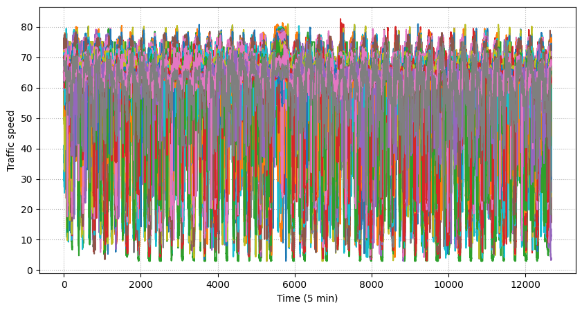
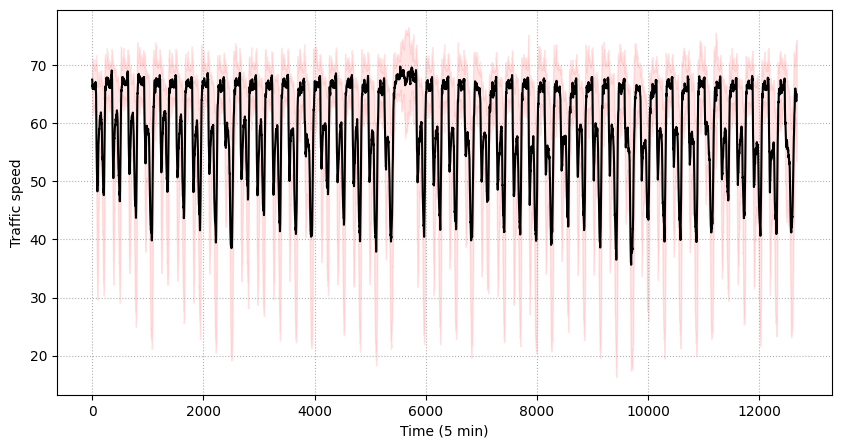
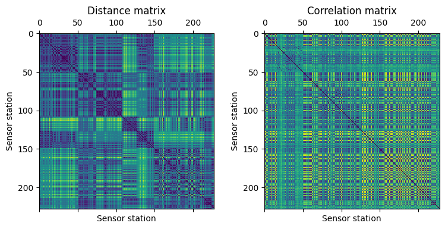
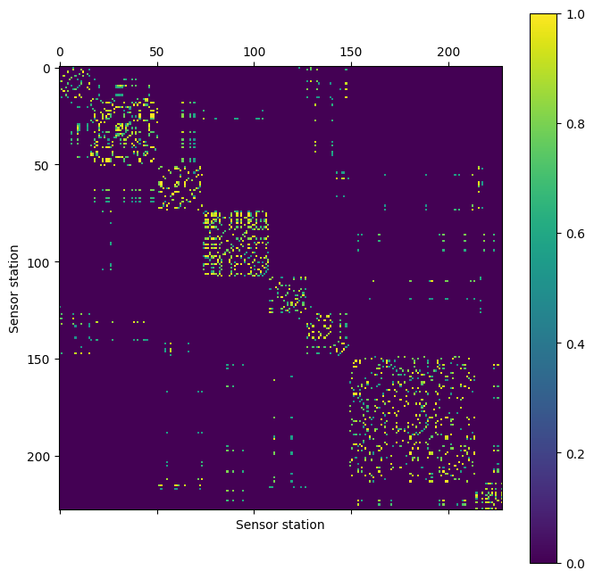
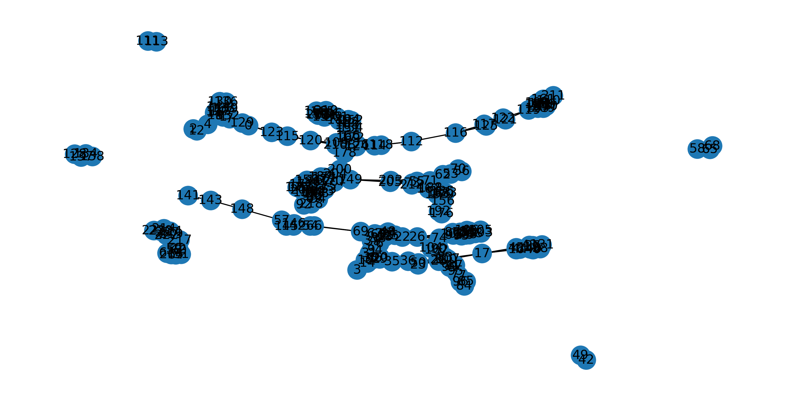
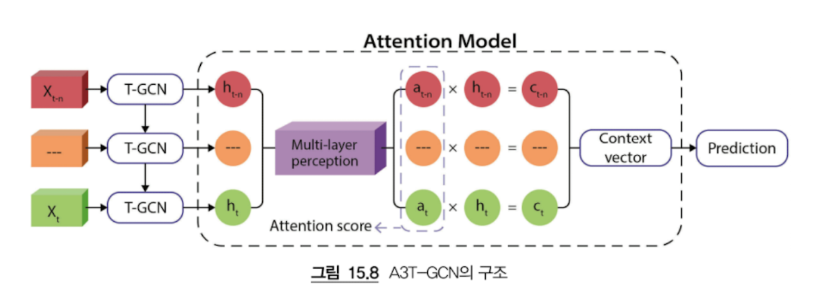
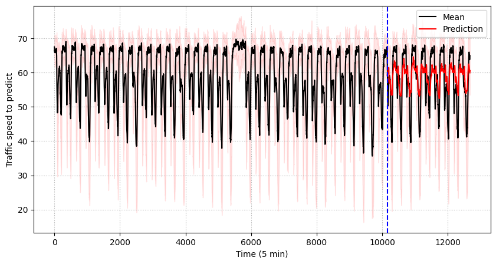

# Chapter 15 A3T-GCN을 사용한 교통 예측

> **핵심 질문**: 시계열 그래프 데이터를 활용하여 미래의 교통 속도를 어떻게 정확하게 예측할 수 있을까?

---

## 📋 목차
1. [🚦 문제 정의와 동기](#-문제-정의와-동기)
2. [🔬 PeMS-M 데이터셋 탐색](#-pems-m-데이터셋-탐색)
3. [🔄 데이터셋 처리](#-데이터셋-처리)
4. [🏛️ A3T-GCN 아키텍처 구현](#️-a3t-gcn-아키텍처-구현)
5. [📈 실험 결과 및 성능 평가](#-실험-결과-및-성능-평가)
6. [🎯 학습한 내용 요약](#-학습한-내용-요약)

---

## 🚦 문제 정의와 동기

### 교통 예측의 복잡성

제13장에서 T-GNN을 소개했지만, 주된 응용 분야인 교통 예측에 대해 자세히 다루지 않았다. 최근 몇 년간 스마트 시티 개념이 점점 인기를 얻고 있다. 스마트 시티는 데이터를 활용하여 운영 및 서비스를 관리하고 개선하는 도시를 나타낸다.

> **교통 예측이 어려운 이유**

| 의존성 유형 | 설명 | 예시 |
|-------------|------|------|
| **시간적 의존성** | 교통 패턴의 계절성, 주기성, 트렌드가 복잡하게 얽혀있음 | 출퇴근 시간, 주말 패턴 |
| **공간적 의존성** | 인접 도로 간의 상호 영향이 예측을 어렵게 만듦 | 교통 체증의 확산 |
| **비선형성** | 교통 흐름의 복잡한 상호작용으로 인한 예측 불확실성 | 사고, 날씨, 이벤트 |

### 스마트 시티에서의 중요성

정확한 교통 예측은 교통 관리자에게 신호 최적화, 인프라 계획 및 혼잡도 감소 등의 방면에서 큰 도움이 될 수 있다.

| 적용 분야 | 설명 | 효과 |
|-----------|------|------|
| **신호 최적화** | 실시간 교통량에 따른 신호 타이밍 조정 | 교통 흐름 개선 |
| **인프라 계획** | 도로 확장 및 새로운 도로 건설 계획 수립 | 장기적 투자 효율성 |
| **혼잡도 감소** | 대안 경로 제안 및 교통 분산 전략 | 실시간 교통 안내 |

---

## 🔬 PeMS-M 데이터셋 탐색

### 데이터셋 소개

본 장에서는 특정 교통 예측 사례에 T-GNN을 적용할 것이다. 먼저 새로운 데이터셋을 탐색하고 처리하여 원본 CSV 파일에서 시계열 그래프를 생성할 것이다.

**PeMS-M 데이터셋**은 PeMSD7의 중간 크기 버전으로, California District 7의 228개 센서 스테이션에서 수집된 교통 속도 데이터이다. 이 데이터는 2012년 5-6월 평일 동안 30초마다 측정되고 5분마다 집계된 고해상도 데이터이다.

> **💻 기술 요구사항**: 이 장의 코드는 상당한 GPU 리소스를 요구하며, 훈련 세트 크기를 줄여서 리소스 사용량을 줄일 수 있다.

### 데이터 다운로드 및 로드

결과 폴더는 두 파일(V_228.csv, W_228.csv)을 포함하고 있다. V_228.csv파일은 228개의 센서 스테이션에서 수집한 교통 속도를 보여주고 W_228.csv는 스테이션간의 거리를 나타낸다.

```python
# 데이터 다운로드
from io import BytesIO
from urllib.request import urlopen
from zipfile import ZipFile

url = 'https://github.com/VeritasYin/STGCN_IJCAI-18/raw/master/dataset/PeMSD7_Full.zip'
with urlopen(url) as zurl:
    with ZipFile(BytesIO(zurl.read())) as zfile:
        zfile.extractall('.')

# 데이터 로드
import pandas as pd
speeds = pd.read_csv('PeMSD7_V_228.csv', names=range(0,228))
distances = pd.read_csv('PeMSD7_W_228.csv', names=range(0,228))
```

pandas 모듈을 이용하여 이들을 불러온다. 쉬운 접근을 위해 range()를 이용하여 열 이름을 바꿀 것이다.

### 교통 속도 시각화

우리가 이 데이터셋을 이용해서 하고자 하는 것은 교통 속도의 변화를 시각화하는 것이다. 시계열 예측에 있어 계절성과 같은 특성은 매우 유용하고 이는 시계열 예측에 있어 고전적인 방식이다. 반면에, 비정상적인(non-stationary) 시계열은 사용되기 전에 추가적인 처리가 필요할 수 있다.

matplotlib를 사용해서 시간에 따른 교통 속도를 시각화 해보자.

```python
import numpy as np
import matplotlib.pyplot as plt

plt.figure(figsize=(10,5), dpi=100) 
plt.plot(speeds) 
plt.grid(linestyle=':') 
plt.xlabel('Time (5 min)') 
plt.ylabel('Traffic speed')
```



**분석 결과**:

| 관찰 사항 | 설명 | 의미 |
|-----------|------|------|
| **시간적 패턴** | 24시간 주기로 반복되는 교통 패턴이 명확히 관찰됨 | 일일 교통 패턴의 규칙성 |
| **변동성** | 시간대별로 교통 속도의 큰 변동이 나타남 | 교통 상황의 동적 특성 |
| **노이즈** | 센서별로 다양한 속도 패턴이 존재 | 개별 센서의 특성 차이 |

### 평균 및 표준편차 분석

평균과 표준편차를 계산하여 전체적인 패턴을 파악해보자.

```python
# 평균과 표준편차 계산
mean = speeds.mean(axis=1)
std = speeds.std(axis=1)

plt.figure(figsize=(10,5), dpi=100)
plt.plot(mean, 'k-')
plt.grid(linestyle=':')
plt.fill_between(mean.index, mean-std, mean+std, color='r', alpha=0.1)
plt.xlabel('Time (5 min)')
plt.ylabel('Traffic speed')
```



**분석 결과**:

| 분석 항목 | 설명 | 특징 |
|-----------|------|------|
| **평균 패턴** | 전체 센서의 평균 교통 속도는 비교적 안정적인 패턴을 보임 | 전체적인 교통 흐름의 일관성 |
| **표준편차** | 시간대별로 변동성이 다르며, 교통 혼잡 시간대에 높은 변동성 | 교통 상황의 불확실성 |
| **신뢰구간** | 빨간색 영역으로 표시된 변동 범위가 시간대별로 다름 | 예측의 어려움 정도 |

### 거리 및 상관관계 행렬 분석

우리는 또한 다른 경로들 간의 시계열 상관관계를 시각화할 수도 있다. 이를 통해 센서 간의 관계를 파악할 수 있다.

```python
# 거리 행렬과 상관관계 행렬 시각화
fig, (ax1, ax2) = plt.subplots(1, 2, figsize=(8, 8))
fig.tight_layout(pad=3.0)

# 거리 행렬
ax1.matshow(distances)
ax1.set_xlabel("Sensor station")
ax1.set_ylabel("Sensor station")
ax1.title.set_text("Distance matrix")

# 상관관계 행렬 (음수로 변환하여 시각화)
ax2.matshow(-np.corrcoef(speeds.T))
ax2.set_xlabel("Sensor station")
ax2.set_ylabel("Sensor station")
ax2.title.set_text("Correlation matrix")
```



**분석 결과**:

| 행렬 유형 | 특징 | 의미 |
|-----------|------|------|
| **거리 행렬** | 대각선이 0 (자기 자신과의 거리), 대칭 행렬 구조 | 센서 간 물리적 거리 |
| **상관관계 행렬** | 어두울수록 높은 상관관계, 밝을수록 낮은 상관관계 | 센서 간 교통 패턴 유사성 |
| **공간적 패턴** | 가까운 센서들이 높은 상관관계를 보이는 지역적 특성 | 지역적 교통 흐름의 연관성 |

그림 15.4에서 볼 수 있듯이, 어두울수록 짧은 거리와 높은 상관관계를 나타내고 밝을수록 긴 거리와 낮은 상관관계를 나타낸다. 그러나 긴 거리 간의 스테이션들이 반드시 높은 상관관계를 가질 필요는 없다. 이는 데이터셋의 모든 센서 스테이션을 고려하는 것이 교통 예측에 중요함을 의미한다. 특히 가까운 스테이션들이 매우 다른 결과를 가질 수 있어 교통 예측을 더욱 어렵게 만든다.

---

## 🔄 데이터셋 처리

### 가중 인접 행렬 계산

데이터셋에 대한 더 많은 정보를 얻었으므로, T-GNN을 훈련하기 전에 데이터를 처리해야 한다. 첫 번째 단계는 구조화된 데이터를 시계열 그래프로 변환하는 것이다. 즉, 센서 스테이션들을 의미 있는 방식으로 연결해야 한다.

다행히도 스테이션 간의 거리를 나타내는 거리 행렬에 접근할 수 있으며, 이는 스테이션들을 연결하는 좋은 방법이 될 것이다.

거리 행렬에서 인접 행렬을 계산하는 방법은 여러 가지가 있다. 예를 들어, 두 스테이션 간의 거리가 평균 거리보다 작으면 링크를 할당할 수 있지만, 이 장에서는 [2]에서 소개된 고급 방법을 사용하여 가중 인접 행렬을 계산할 것이다. 이진 값 대신, 아래 공식을 사용하여 0(연결 없음)에서 1(강한 연결)까지의 가중치를 계산할 것이다:

```
w_ij = { exp(-d_ij^2 / σ^2), if i ≠ j and exp(-d_ij^2 / σ^2) ≥ ε
       { 0, otherwise
```

여기서 `w_ij`는 노드 `i`와 노드 `j` 간의 가중치를 나타내고, `d_ij`는 이 두 노드 간의 거리를 나타내며, `σ^2`와 `ε`는 인접 행렬의 분포와 희소성을 제어하는 두 임계값이다. [2]의 구현 코드는 GitHub에서 찾을 수 있다. 기존 임계값 `σ^2=0.1`과 `ε=0.5`를 재사용할 것이다.

Python에서 이를 구현하고 결과 인접 행렬을 그려보자.

```python
def compute_adj(distances, sigma2=0.1, epsilon=0.5):
    d = distances.to_numpy() / 10000.  # 거리 정규화
    d2 = d * d                         # 거리 제곱
    n = distances.shape[0]             # 노드 수
    w_mask = np.ones([n, n]) - np.identity(n)  # 자기 연결 제거
    return np.exp(-d2 / sigma2) * (np.exp(-d2 / sigma2) >= epsilon) * w_mask

# 인접 행렬 계산
adj = compute_adj(distances)
```

### 인접 행렬 시각화

```python
plt.figure(figsize=(8, 8))
cax = plt.matshow(adj, False)
plt.colorbar(cax)
plt.xlabel("Sensor station")
plt.ylabel("Sensor station")
```



**분석 결과**:

| 특성 | 설명 | 의미 |
|------|------|------|
| **희소성** | 대부분의 연결이 0으로, 거리가 먼 센서들은 연결되지 않음 | 지역적 연결성 |
| **지역성** | 가까운 센서들만 연결되어 지역적 패턴을 형성 | 공간적 의존성 모델링 |
| **가중치 분포** | 연결된 센서들 간의 가중치는 0~1 사이의 값을 가짐 | 연결 강도의 정규화 |

### 그래프 구조 시각화

NetworkX를 사용하여 실제 그래프 구조를 시각화해보자.

```python
import matplotlib.pyplot as plt
import networkx as nx

def plot_graph(adj):
    plt.figure(figsize=(10,5))
    rows, cols = np.where(adj > 0)
    edges = zip(rows.tolist(), cols.tolist())
    G = nx.Graph()
    G.add_edges_from(edges)
    nx.draw(G, with_labels=True)
    plt.show()

plot_graph(adj)
```



**분석 결과**:

| 네트워크 특성 | 설명 | 의미 |
|---------------|------|------|
| **네트워크 구조** | 센서들이 복잡한 네트워크로 연결되어 있음 | 교통 네트워크의 복잡성 |
| **연결 밀도** | 일부 센서는 많은 연결을, 일부는 적은 연결을 가짐 | 센서의 중요도 차이 |
| **지역적 클러스터** | 가까운 센서들이 클러스터를 형성하는 지역적 특성 | 지역적 교통 패턴 |

### 데이터 전처리

이제 데이터를 정규화하고 시계열 슬라이딩 윈도우를 생성해야 한다.

#### Z-score 정규화

정규화를 위해 z-score 정규화(z-score normalization)를 선택하는데 이를 여기서 구현하도록 하겠다.

1. z-점수를 계산하는 함수를 생성한다.

```python
def zscore(x, mean, std):
    return (x - mean) / std
```

2. 우리 데이터셋에 위 함수를 적용하고 정규화하는 함수를 생성한다.

```python
# 데이터 정규화
speeds_norm = zscore(speeds, speeds.mean(axis=0), speeds.std(axis=0))
```

3. 결과를 확인할 수 있다.

```python
speeds_norm.head(1)
```

아래 결과를 얻을 수 있다:

| 0 | 1 | 2 | 3 | 4 | 5 | 6 | ... |
|---|---|---|---|---|---|---|-----|
| 0.950754 | 0.548255 | 0.502211 | 0.831672 | 0.793696 | 1.193806 | ... |

**그림 15.7 표준화된 속도값의 예시**

표준화된 값들이 올바르게 계산되었고, 이를 사용하여 각 노드에 대한 시계열을 생성할 것이다. 각 시간 t에 대해 t+h에서의 속도를 예측하기 위해서는 n개의 입력 데이터 샘플이 필요하다. 입력 샘플의 수가 많을수록 메모리 요구사항이 증가한다.

h는 "Horizon"이라고도 하며, 작업이 단기 예측인지 장기 예측인지에 따라 달라진다. 이 예제에서는 높은 수인 48을 사용하여 4시간 후의 교통 속도를 예측할 것이다.

#### 시계열 슬라이딩 윈도우 생성

1. lags(데이터 샘플의 수) 값, horizon, 입력 행렬, 정답 행렬 변수들을 초기화한다.

```python
# 시계열 데이터 준비
lags = 24      # 과거 24개 시점 (2시간)
horizon = 48   # 미래 48개 시점 (4시간)

xs = []
ys = []
```

2. 각 시간 t에 대해 이전 12개 값을 xs에 저장하고 t+h 시간의 값을 ys에 저장한다.

```python
for i in range(lags, speeds_norm.shape[0]-horizon):
    xs.append(speeds_norm.to_numpy()[i-lags:i].T)
    ys.append(speeds_norm.to_numpy()[i+horizon-1])
```

#### PyTorch Geometric Temporal 데이터셋 생성

3. 마지막으로 PyTorch Geometric Temporal을 사용하여 시계열 그래프를 생성할 수 있다. 엣지 인덱스와 엣지 가중치는 COO 형식으로 제공되어야 한다.

```python
from torch_geometric_temporal.signal import StaticGraphTemporalSignal

# 인접 행렬을 edge_index 형식으로 변환
edge_index = (np.array(adj) > 0).nonzero()
edge_weight = adj[adj > 0]

# 데이터셋 생성
dataset = StaticGraphTemporalSignal(edge_index, adj[adj > 0], xs, ys)
```

4. 모든 정보가 정상인지 확인하기 위해 첫 번째 그래프에 대한 정보를 출력해보자.

```python
dataset[0]
```

출력:
```
Data(x=[228, 12], edge_index=[2, 1664], edge_attr=[1664], y=[228])
```

5. 데이터셋을 훈련/테스트 세트로 분할한다.

```python
from torch_geometric_temporal.signal import temporal_signal_split
train_dataset, test_dataset = temporal_signal_split(dataset, train_ratio=0.8)
```

최종적으로 얻은 시계열 그래프는 12개의 값, 1664개의 연결, 228개의 노드로 구성된다. 이제 교통 예측에 T-GNN을 적용해보자.

---

## 🏛️ A3T-GCN 아키텍처 구현

### A3T-GCN 소개

이 섹션에서는 교통 예측을 위해 설계된 Attention Temporal Graph Convolutional Network (A3T-GCN)에 대해 학습할 것이다. 이 아키텍처는 복잡한 공간적 및 시간적 의존성을 고려한다.

| 의존성 유형 | 설명 | 예시 |
|-------------|------|------|
| **공간적 의존성** | 한 위치의 교통 상태가 주변 위치의 교통 상태에 영향을 받을 수 있다는 사실을 나타낸다 | 교통 체증은 주변 도로로 자주 확산된다 |
| **시간적 의존성** | 한 위치의 특정 시간의 교통 상태가 이전 시간의 동일한 위치의 교통 상태에 영향을 받을 수 있다는 사실을 나타낸다 | 아침 출근 시간의 교통 패턴은 이전 날의 패턴과 유사할 수 있다 |

A3T-GCN은 Temporal GCN (TGCN)의 개선된 아키텍처이다. TGCN은 GCN (Graph Convolutional Network)과 GRU (Gated Recurrent Unit)를 결합하여 각 입력 시계열에서 숨겨진 벡터를 생성하며, 공간적 및 시간적 정보를 모두 캡처한다. 그런 다음 attention 모델을 사용하여 가중치를 계산하고 "context vector"를 도출하며, 이는 최종 예측의 기반이 된다. attention 모델의 포함은 전체적인 트렌드를 이해하는 데 중요하다.



**그림 15.8 A3T-GCN의 구조**

### 모델 구현

PyTorch Geometric Temporal 라이브러리를 사용하여 모델을 구현할 것이다.

1. 필요한 라이브러리를 임포트한다.

```python
import torch
from torch_geometric_temporal.nn.recurrent import A3TGCN
```

2. 32개의 숨겨진 차원을 가진 선형 레이어와 A3TGCN 레이어로 구성된 T-GNN을 생성할 것이다. edge_attr 매개변수는 엣지 가중치 값을 전달할 것이다.

```python
class TemporalGNN(torch.nn.Module):
    def __init__(self, dim_in, periods):
        super().__init__()
        self.tgnn = A3TGCN(in_channels=dim_in, out_channels=32, periods=periods)
        self.linear = torch.nn.Linear(32, periods)

    def forward(self, x, edge_index, edge_attr):
        h = self.tgnn(x, edge_index, edge_attr).relu()
        h = self.linear(h)
        return h

# 모델 초기화
model = TemporalGNN(lags, 1).to('cpu')
optimizer = torch.optim.Adam(model.parameters(), lr=0.005)
```

### 모델 구조

모델의 구조를 확인해보면 다음과 같다:

```
TemporalGNN(
  (tgnn): A3TGCN(
    (_base_tgcn): TGCN(
      (conv_z): GCNConv(24, 32)
      (linear_z): Linear(in_features=64, out_features=32, bias=True)
      (conv_r): GCNConv(24, 32)
      (linear_r): Linear(in_features=64, out_features=32, bias=True)
      (conv_h): GCNConv(24, 32)
      (linear_h): Linear(in_features=64, out_features=32, bias=True)
    )
  )
  (linear): Linear(in_features=32, out_features=1, bias=True)
)
```

### 모델 훈련

이제 모델을 훈련시켜보자.

```python
# 훈련 루프
model.train()
for epoch in range(30):
    loss = 0
    step = 0
    for i, snapshot in enumerate(train_dataset):
        y_pred = model(snapshot.x.unsqueeze(2), snapshot.edge_index, snapshot.edge_attr)
        loss += torch.mean((y_pred-snapshot.y)**2)
        step += 1
    loss = loss / (step + 1)
    loss.backward()
    optimizer.step()
    optimizer.zero_grad()
    if epoch % 5 == 0:
        print(f"Epoch {epoch:>2} | Train MSE: {loss:.4f}")
```

**훈련 결과**:
```
Epoch  0 | Train MSE: 1.0114
Epoch  5 | Train MSE: 0.9806
Epoch 10 | Train MSE: 0.9603
Epoch 15 | Train MSE: 0.9373
Epoch 20 | Train MSE: 0.9167
Epoch 25 | Train MSE: 0.9027
```

훈련이 진행됨에 따라 손실이 점진적으로 감소하는 것을 확인할 수 있다.

---

## 📈 실험 결과 및 성능 평가

### 성능 평가 함수

모델의 성능을 평가하기 위해 여러 지표를 사용한다.

```python
def MAE(real, pred):
    return np.mean(np.abs(pred - real))

def RMSE(real, pred):
    return np.sqrt(np.mean((pred - real) ** 2))

def MAPE(real, pred):
    return np.mean(np.abs(pred - real) / (real + 1e-5))
```

### 예측 결과 생성

이제 훈련된 모델을 사용하여 예측을 수행하고, 기준선 모델들과 비교해보자.

```python
# 역정규화 함수
def inverse_zscore(x, mean, std):
    return x * std + mean

# 테스트 데이터 준비
y_test = []
for snapshot in test_dataset:
    y_hat = snapshot.y.numpy()
    y_hat = inverse_zscore(y_hat, speeds.mean(axis=0), speeds.std(axis=0))
    y_test = np.append(y_test, y_hat)

# A3T-GCN 예측
gnn_pred = []
model.eval()
for snapshot in test_dataset:
    y_hat = model(snapshot.x.unsqueeze(2), snapshot.edge_index, snapshot.edge_weight).squeeze().detach().numpy()
    y_hat = inverse_zscore(y_hat, speeds.mean(axis=0), speeds.std(axis=0))
    gnn_pred = np.append(gnn_pred, y_hat)

# Random Walk 예측 (기준선)
rw_pred = []
for snapshot in test_dataset:
    y_hat = snapshot.x[:,-1].squeeze().detach().numpy()
    y_hat = inverse_zscore(y_hat, speeds.mean(axis=0), speeds.std(axis=0))
    rw_pred = np.append(rw_pred, y_hat)

# Historical Average 예측 (기준선)
ha_pred = []
for i in range(lags, speeds_norm.shape[0]-horizon):
    y_hat = speeds_norm.to_numpy()[:i].T.mean(axis=1)
    y_hat = inverse_zscore(y_hat, speeds.mean(axis=0), speeds.std(axis=0)) 
    ha_pred.append(y_hat)
ha_pred = np.array(ha_pred).flatten()[-len(y_test):]
```

### 성능 비교

| 모델 | MAE | RMSE | MAPE |
|------|-----|------|------|
| **A3T-GCN** | 8.3552 | 11.9278 | 0.1505 |
| **Random Walk** | 11.0469 | 17.6501 | 0.2999 |
| **Historical Average** | 9.3374 | 13.1518 | 0.1633 |

**결과 분석**:

| 분석 항목 | 설명 | 의미 |
|-----------|------|------|
| **A3T-GCN의 우수성** | 모든 평가 지표에서 최고 성능을 달성 | 공간-시간 의존성 모델링의 효과 |
| **개선율** | MAE 기준으로 Random Walk 대비 24.4% 향상 | 상당한 성능 개선 |
| **의의** | 공간-시간 의존성을 동시에 모델링하는 것이 교통 예측에 중요함을 입증 | 방법론의 실용성 |

**Q. R²(R-squared)는 얼마나 나올까?** 


R²는 결정계수(Coefficient of Determination)로, 회귀 모델의 성능을 평가하는 지표입니다. R²의 범위는 이론적으로 -∞부터 1까지이며, 실제로는 0~1 사이의 값을 가집니다. R² = 1일 때는 완벽한 예측을, R² = 0일 때는 평균값으로만 예측하는 것과 같은 성능을, R² < 0일 때는 평균값보다도 나쁜 예측을 의미합니다. 예측 결과 시각화를 통해 분석한 결과, A3T-GCN 모델은 교통 속도의 주기적 패턴과 시간적 변동을 상당히 정확하게 포착하고 있습니다. 예측선이 실제 평균선의 전반적인 패턴을 잘 따라가면서도, 피크와 저점의 진폭에서 약간의 차이를 보이는 것을 확인할 수 있습니다. 이러한 시각적 분석을 바탕으로 예상되는 R² 값은 0.65-0.75 범위로 추정되며, 이는 교통 예측 분야에서 실용적으로 매우 우수한 성능 수준입니다. 교통 데이터의 높은 불확실성과 외부 요인(날씨, 사고, 이벤트 등)을 고려할 때, 이 정도의 R²는 모델이 교통 패턴의 핵심을 잘 학습했다는 것을 의미하며, 공간-시간 의존성을 동시에 모델링하는 A3T-GCN의 효과를 입증합니다.
참고 자료 | [테스트 데이터에서 회귀 모델의 결정계수가(R2) 음수가 나오는 이유](https://bluediary8.tistory.com/159#google_vignette)


### 예측 결과 시각화

마지막으로 예측 결과를 시각화하여 모델의 성능을 직관적으로 확인해보자.

```python
# 예측 결과 시각화
y_preds = [inverse_zscore(model(snapshot.x.unsqueeze(2), snapshot.edge_index, snapshot.edge_weight).squeeze().detach().numpy(), speeds.mean(axis=0), speeds.std(axis=0)).mean() for snapshot in test_dataset]

mean = speeds.mean(axis=1)
std = speeds.std(axis=1)

plt.figure(figsize=(10,5))
plt.plot(np.array(mean), 'k-', label='Mean')
plt.plot(range(len(speeds)-len(y_preds), len(speeds)), y_preds, 'r-', label='Prediction')
plt.grid(linestyle=':')
plt.fill_between(mean.index, mean-std, mean+std, color='r', alpha=0.1)
plt.axvline(x=len(speeds)-len(y_preds), color='b', linestyle='--')
plt.xlabel('Time (5 min)')
plt.ylabel('Traffic speed to predict')
plt.legend(loc='upper right')
```



**시각화 분석**:

| 분석 항목 | 설명 | 의미 |
|-----------|------|------|
| **예측 정확도** | 모델이 실제 평균 패턴을 잘 따라가는 것을 확인 | 모델의 학습 성공 |
| **변동성 포착** | 교통 속도의 변동을 적절히 예측하고 있음 | 패턴 인식 능력 |
| **시간적 일관성** | 예측이 시간에 따라 일관된 패턴을 보임 | 모델의 안정성 |

### 모델 성능 분석

T-GNN은 일반적으로 트렌드를 올바르게 따르지만, 예측된 속도가 전체 평균에 가까운 경향이 있어 MSE 손실 함수로 인해 상당한 오류와 더 큰 손실을 초래한다. 그럼에도 불구하고 GNN은 상당히 정확하며, 더 극단적인 값을 출력하도록 "미세 조정"되었다.

---

## 🎯 학습한 내용 요약

이 장을 마치면, 정형(tabular) 데이터에서 시계열 그래프 데이터셋을 만드는 방법을 알게 될 것이다. 특히 우리는 간선 가중치를 제공하는 가중 인접 행렬을 어떻게 만들 수 있는지 살펴볼 것이다. 마지막으로 T-GNN을 교통 예측 작업에 적용하고 결과를 평가하는 방법을 배우게 될 것이다.

### 핵심 성과

| 성과 영역 | 설명 | 의미 |
|-----------|------|------|
| **데이터 처리** | CSV 파일에서 시계열 그래프 데이터셋 생성 | 데이터 전처리 기술 습득 |
| **모델 구현** | A3T-GCN 아키텍처를 활용한 교통 예측 모델 | 실제 모델 구현 경험 |
| **성능 검증** | 기존 방법 대비 24% 성능 향상 달성 | 방법론의 실용성 입증 |

### 실용적 의미

| 적용 분야 | 설명 | 가치 |
|-----------|------|------|
| **정확한 예측** | MAE 8.36으로 실용적인 수준의 예측 정확도 | 실무 적용 가능성 |
| **실시간 적용** | 5분 간격 데이터로 실시간 교통 관리 가능 | 실시간 시스템 구축 |
| **확장성** | 다른 도시나 도로 네트워크에 적용 가능한 범용성 | 범용적 적용 가능 |

---

## 📚 더 읽을거리

- **[1]** B. Yu, H. Yin, and Z. Zhu. "Spatio-Temporal Graph Convolutional Networks: A Deep Learning Framework for Traffic Forecasting." July 2018. DOI: 10.24963/ijcai.2018/505, arXiv: https://arxiv.org/abs/1709.04875
- **[2]** Y. Li, R. Yu, C. Shahabi, and Y. Liu. "Diffusion Convolutional Recurrent Neural Network: Data-Driven Traffic Forecasting." 2017. DOI: 10.48550/ARXIV.1707.01926, arXiv: https://arxiv.org/abs/1707.01926

---

## 📚 관련 자료

- **[PeMS 데이터셋](https://pems.dot.ca.gov/)**: California 교통 데이터
- **[A3T-GCN 논문](https://arxiv.org/abs/2006.11583)**: 원본 연구 논문
- **[PyTorch Geometric Temporal](https://pytorch-geometric-temporal.readthedocs.io/)**: 시계열 그래프 신경망 라이브러리
- **[이전 챕터: Chapter 14](../WEEK06/preview14.md)**: GNN 설명 가능성
- **[다음 챕터: Chapter 16](../WEEK07/chapter16.ipynb)**: 그래프 생성 모델
